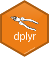
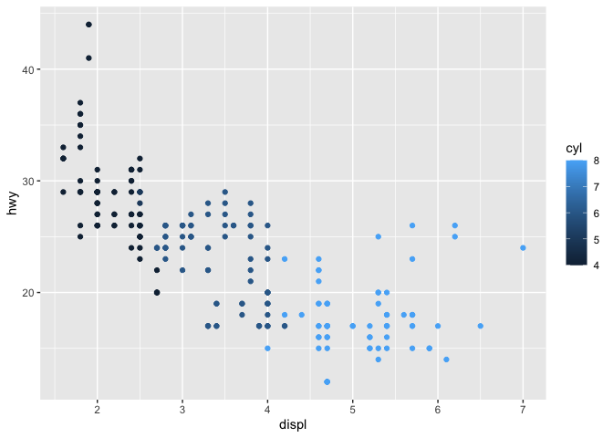
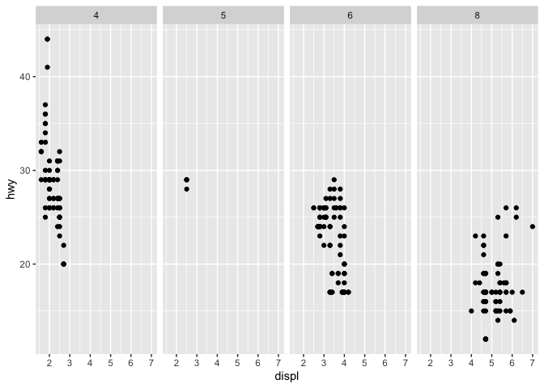
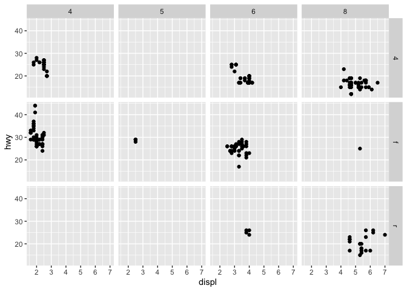
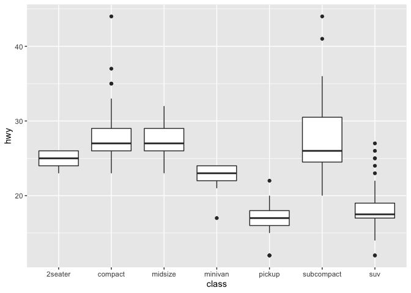
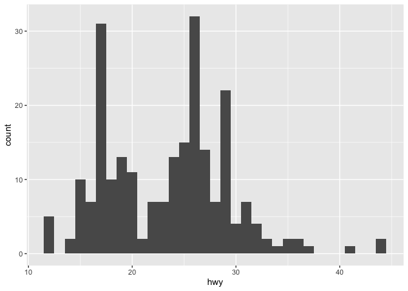
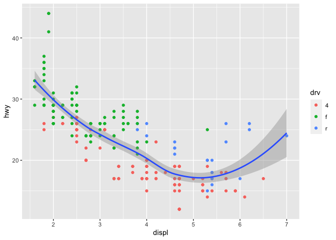
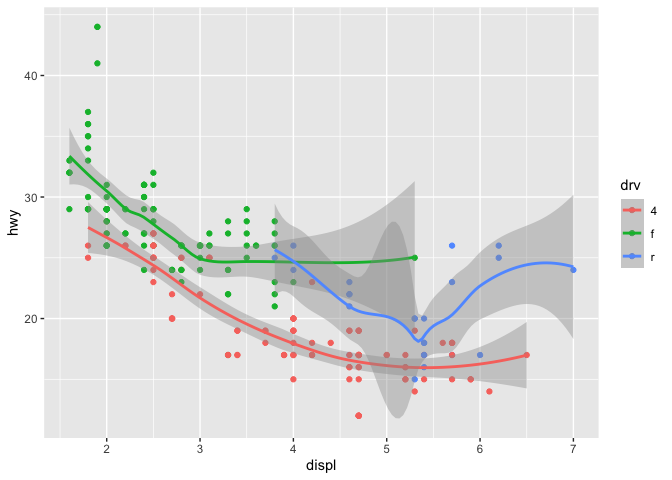
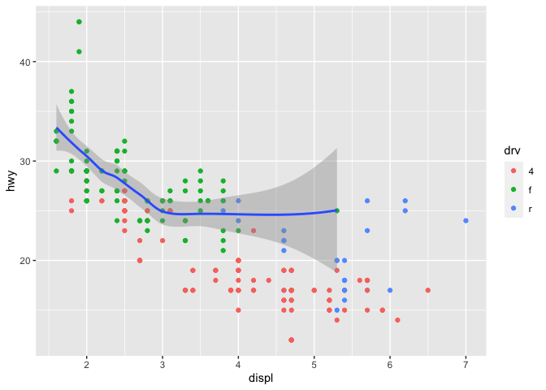

Tidyverse is a set of package for doing data science.  [R for Data Science](https://r4ds.had.co.nz/index.html) by Garrett Grolemund, Hadley Wickham model Data Science in the following way.


```r
library(knitr)
knitr::opts_chunk$set(echo = TRUE)

library(tidyverse)
```

```
## ── Attaching packages ─────────────────────────────────────── tidyverse 1.3.0 ──
```

```
## ✓ ggplot2 3.3.2     ✓ purrr   0.3.4
## ✓ tibble  3.0.3     ✓ dplyr   1.0.2
## ✓ tidyr   1.1.1     ✓ stringr 1.4.0
## ✓ readr   1.3.1     ✓ forcats 0.5.0
```

```
## ── Conflicts ────────────────────────────────────────── tidyverse_conflicts() ──
## x dplyr::filter() masks stats::filter()
## x dplyr::lag()    masks stats::lag()
```

We will start learning about Tidyverse tools by starting at the first step in this process, importing data.

***

## Step 1: Import data with [readr](https://readr.tidyverse.org/) 

> “The goal of 'readr' is to provide a fast and friendly way to read rectangular data (like 'csv', 'tsv', and 'fwf'). It is designed to flexibly parse many types of data found in the wild, while still cleanly failing when data unexpectedly changes.”
>

The readr package gets loaded automatically when you use library(tidyverse), or you can load it directly.

```r
library(readr)
```

***


#### readr supports a number of file formats with different read_* functions including:

* read_csv(): comma separated (CSV) files
* read_tsv(): tab separated (TSV) files
* read_delim(): general delimited files (you must supply delimiter!)
* read_fwf(): fixed width files           
* read_table(): tabular files where columns are separated by white-space.
* read_log(): web log files

#### Readr also has functions write data in a number of formats with various write_* functions:

* write_csv(): comma separated (CSV) files
* write_tsv(): tab separated (TSV) files
* write_delim(): general delimited files
* write_excel_csv(): comma separated files for Excel

***

#### Get some data and try out these functions:

Note that this data set is from the ggplot2 package.


```r
read_tsv("https://raw.githubusercontent.com/ucdavis-bioinformatics-training/2020-Bioinformatics_Prerequisites_Workshop/master/Intro_to_R/Intro2R/mpg.tsv")
```

```
## Parsed with column specification:
## cols(
##   manufacturer = col_character(),
##   model = col_character(),
##   displ = col_double(),
##   year = col_double(),
##   cyl = col_double(),
##   trans = col_character(),
##   drv = col_character(),
##   cty = col_double(),
##   hwy = col_double(),
##   fl = col_character(),
##   class = col_character()
## )
```

```
## # A tibble: 234 x 11
##    manufacturer model    displ  year   cyl trans   drv     cty   hwy fl    class
##    <chr>        <chr>    <dbl> <dbl> <dbl> <chr>   <chr> <dbl> <dbl> <chr> <chr>
##  1 audi         a4         1.8  1999     4 auto(l… f        18    29 p     comp…
##  2 audi         a4         1.8  1999     4 manual… f        21    29 p     comp…
##  3 audi         a4         2    2008     4 manual… f        20    31 p     comp…
##  4 audi         a4         2    2008     4 auto(a… f        21    30 p     comp…
##  5 audi         a4         2.8  1999     6 auto(l… f        16    26 p     comp…
##  6 audi         a4         2.8  1999     6 manual… f        18    26 p     comp…
##  7 audi         a4         3.1  2008     6 auto(a… f        18    27 p     comp…
##  8 audi         a4 quat…   1.8  1999     4 manual… 4        18    26 p     comp…
##  9 audi         a4 quat…   1.8  1999     4 auto(l… 4        16    25 p     comp…
## 10 audi         a4 quat…   2    2008     4 manual… 4        20    28 p     comp…
## # … with 224 more rows
```

Alternatively we could use another of the readr functions, **read_lines**, to look at the first few lines of the file:


```r
read_lines("https://raw.githubusercontent.com/ucdavis-bioinformatics-training/2020-Bioinformatics_Prerequisites_Workshop/master/Intro_to_R/Intro2R/mpg.tsv", n_max = 5)
```

```
## [1] "manufacturer\tmodel\tdispl\tyear\tcyl\ttrans\tdrv\tcty\thwy\tfl\tclass"
## [2] "audi\ta4\t1.8\t1999\t4\tauto(l5)\tf\t18\t29\tp\tcompact"               
## [3] "audi\ta4\t1.8\t1999\t4\tmanual(m5)\tf\t21\t29\tp\tcompact"             
## [4] "audi\ta4\t2\t2008\t4\tmanual(m6)\tf\t20\t31\tp\tcompact"               
## [5] "audi\ta4\t2\t2008\t4\tauto(av)\tf\t21\t30\tp\tcompact"
```

We could also check the number of lines by reading the whole file and counting the lines. This approach will be slow for large files:

```r
length(read_lines("https://raw.githubusercontent.com/ucdavis-bioinformatics-training/2020-Bioinformatics_Prerequisites_Workshop/master/Intro_to_R/Intro2R/mpg.tsv"))
```

```
## [1] 235
```

Using the functions you just ran, answer the following questions:

* How many lines does the file have?
* What is the first line of the file?
* What separates the values in the file?

***

To read the file and store it in an object, we assign the output of the read_tsv function to an object.


```r
mpg <- read_tsv('mpg.tsv')
```

```
## Parsed with column specification:
## cols(
##   manufacturer = col_character(),
##   model = col_character(),
##   displ = col_double(),
##   year = col_double(),
##   cyl = col_double(),
##   trans = col_character(),
##   drv = col_character(),
##   cty = col_double(),
##   hwy = col_double(),
##   fl = col_character(),
##   class = col_character()
## )
```

#### What are "Column Specifications"?

Computers use different types of containers to store different types of data. In tidyverse all numeric data (floating point and integer) is [stored as a 64-bit double](https://www.tidyverse.org/blog/2018/12/readr-1-3-1/). Data that is not numeric is stored in character vectors. When reading a file, readr must make a guess about the type of data stored in each column. To do this, readr skims the [first 1000 lines](https://readr.tidyverse.org/articles/readr.html) of the file, investigating the values it finds there, and using them to make a guess at the format of the file.

***

#### Now, let's look at the object we just loaded

* Does the object have the expected number of lines?
* What type of object is it?


```r
mpg
```

```
## # A tibble: 234 x 11
##    manufacturer model    displ  year   cyl trans   drv     cty   hwy fl    class
##    <chr>        <chr>    <dbl> <dbl> <dbl> <chr>   <chr> <dbl> <dbl> <chr> <chr>
##  1 audi         a4         1.8  1999     4 auto(l… f        18    29 p     comp…
##  2 audi         a4         1.8  1999     4 manual… f        21    29 p     comp…
##  3 audi         a4         2    2008     4 manual… f        20    31 p     comp…
##  4 audi         a4         2    2008     4 auto(a… f        21    30 p     comp…
##  5 audi         a4         2.8  1999     6 auto(l… f        16    26 p     comp…
##  6 audi         a4         2.8  1999     6 manual… f        18    26 p     comp…
##  7 audi         a4         3.1  2008     6 auto(a… f        18    27 p     comp…
##  8 audi         a4 quat…   1.8  1999     4 manual… 4        18    26 p     comp…
##  9 audi         a4 quat…   1.8  1999     4 auto(l… 4        16    25 p     comp…
## 10 audi         a4 quat…   2    2008     4 manual… 4        20    28 p     comp…
## # … with 224 more rows
```

```r
class(mpg)
```

```
## [1] "spec_tbl_df" "tbl_df"      "tbl"         "data.frame"
```

```r
is_tibble(mpg)
```

```
## [1] TRUE
```

### What is a [Tibble](https://tibble.tidyverse.org/)? 

Tibbles are a modified type of data frame. Everything you have learned about accessing and manipulating data frames still applies, but a tibble behaves a little differently. The documentation describes them like this:

>Tibbles are data.frames that are lazy and surly: they do less (i.e. they don’t change variable names or types, and don’t do partial matching) and complain more (e.g. when a variable does not exist). This forces you to confront problems earlier, typically leading to cleaner, more expressive code.
>

#### Creating tibbles

As we saw above, importing data using the readr package creates a tibble. Additionally, tibbles can be created from existing objects using as_tibble(),

```r
head(iris)
```

```
##   Sepal.Length Sepal.Width Petal.Length Petal.Width Species
## 1          5.1         3.5          1.4         0.2  setosa
## 2          4.9         3.0          1.4         0.2  setosa
## 3          4.7         3.2          1.3         0.2  setosa
## 4          4.6         3.1          1.5         0.2  setosa
## 5          5.0         3.6          1.4         0.2  setosa
## 6          5.4         3.9          1.7         0.4  setosa
```

```r
as_tibble(iris)
```

```
## # A tibble: 150 x 5
##    Sepal.Length Sepal.Width Petal.Length Petal.Width Species
##           <dbl>       <dbl>        <dbl>       <dbl> <fct>  
##  1          5.1         3.5          1.4         0.2 setosa
##  2          4.9         3            1.4         0.2 setosa
##  3          4.7         3.2          1.3         0.2 setosa
##  4          4.6         3.1          1.5         0.2 setosa
##  5          5           3.6          1.4         0.2 setosa
##  6          5.4         3.9          1.7         0.4 setosa
##  7          4.6         3.4          1.4         0.3 setosa
##  8          5           3.4          1.5         0.2 setosa
##  9          4.4         2.9          1.4         0.2 setosa
## 10          4.9         3.1          1.5         0.1 setosa
## # … with 140 more rows
```

created manually by specifying each column,

```r
tibble(
        column1=1:5,
        column2=c("a","b","c","d","e"),
        column3=pi*1:5
       )
```

```
## # A tibble: 5 x 3
##   column1 column2 column3
##     <int> <chr>     <dbl>
## 1       1 a          3.14
## 2       2 b          6.28
## 3       3 c          9.42
## 4       4 d         12.6
## 5       5 e         15.7
```

or row-by-row with tribble().

```r
tribble(
  ~x, ~y,  ~z,
  "a", 2,  3.6,
  "b", 1,  8.5
)
```

```
## # A tibble: 2 x 3
##   x         y     z
##   <chr> <dbl> <dbl>
## 1 a         2   3.6
## 2 b         1   8.5
```

Tibbles can have terrible column names that should never be used. **Good practice is to have unique column names that start with a letter and contain no special characters.**

```r
tibble(
  `terrible column 1` = 1:5,
  `no good :)` = letters[1:5],
  `;very-bad/` = sin(4:8)
)
```

```
## # A tibble: 5 x 3
##   `terrible column 1` `no good :)` `;very-bad/`
##                 <int> <chr>               <dbl>
## 1                   1 a                  -0.757
## 2                   2 b                  -0.959
## 3                   3 c                  -0.279
## 4                   4 d                   0.657
## 5                   5 e                   0.989
```

***

#### Challenge

Create a tibble with 100 rows and 3 columns, write your tibble to a file, and read it back in.
  * Write it out using **write_tsv()**
  * Which function should you use to read back in?
      * Try **read_csv()**. Did it read in successfully?
      * Try to use **read_delim()**. Did that work any better? *hint: specify delimiter*


#### Advanced challenge

Try to generate a [*parsing failure*](https://r4ds.had.co.nz/data-import.html) in readr by creating and writing a tibble that causes problems when read in by read_delim.


Then create R code that allows read_delim to successfully load your treacherous tibble.


***


## Step 2: Tidy data with [tidyr](https://tidyr.tidyverse.org/) 

#### First, what is "tidy" data?

> Tidy data is data where:
>
> 1) Every column is a variable.
>
> 2) Every row is an observation.
>
> 3) Every cell is a single value.
>
> Tidy data describes a standard way of storing data that is used wherever possible throughout the tidyverse. If you ensure that your data is tidy, you’ll spend less time fighting with the tools and more time working on your analysis.
>
[**Wickham, Hadley. "Tidy data." Journal of Statistical Software 59.10 (2014): 1-23.**](https://vita.had.co.nz/papers/tidy-data.pdf)

Definitions:

* A **variable** stores a set of values of a particular type (height, temperature, duration)

* An **observation** is all values measured on the same unit across variables

***

#### There is more than one way we can store data from an experiment.


```r
d1 = data.frame(
        mouse_id = rep(c("A1","A2","A3"), 2),
        treatment = rep(c('a','b'), each = 3),
        mass = c(4,6,9,8,5,4)
)
d2 <- data.frame(
        A1=c(4,8),
        A2=c(6,5),
        A3=c(9,4)
)
rownames(d2) <- c("a","b")
d1
```

```
##   mouse_id treatment mass
## 1       A1         a    4
## 2       A2         a    6
## 3       A3         a    9
## 4       A1         b    8
## 5       A2         b    5
## 6       A3         b    4
```

```r
d2
```

```
##   A1 A2 A3
## a  4  6  9
## b  8  5  4
```

**Is either of these ways of organizing our experiment tidy? Why or why not?**

Remember, for "tidy" data, we're looking for a table where:

1. Every column is a variable
2. Every row is an observation
3. Every cell is a single value

In the two tables above, what are the variables and observations? Where are they stored?

***

#### How do we make our data "tidy?"

First, make the row names into a new column with the **rownames_to_column()** function:

```r
d2.1 <- rownames_to_column(d2, 'treatment')
d2.1
```

```
##   treatment A1 A2 A3
## 1         a  4  6  9
## 2         b  8  5  4
```

Make each row an observation with **pivot_longer()** function:

```r
d2.2 <- pivot_longer(d2.1, cols = -treatment, names_to = "mouse_id", values_to = "mass")
d2.2
```

```
## # A tibble: 6 x 3
##   treatment mouse_id  mass
##   <chr>     <chr>    <dbl>
## 1 a         A1           4
## 2 a         A2           6
## 3 a         A3           9
## 4 b         A1           8
## 5 b         A2           5
## 6 b         A3           4
```

Reorder columns for looks using **select()** function:

```r
d2.3 <- select(d2.2, mouse_id, treatment, mass)
d2.3
```

```
## # A tibble: 6 x 3
##   mouse_id treatment  mass
##   <chr>    <chr>     <dbl>
## 1 A1       a             4
## 2 A2       a             6
## 3 A3       a             9
## 4 A1       b             8
## 5 A2       b             5
## 6 A3       b             4
```

***

### Piping commands together with [magrittr](https://magrittr.tidyverse.org/) 
Although the code above is fairly readable, it is not compact. It also creates three copies of the data (d2.1, d2.2, d2.3). We could use a couple of different strategies for carrying out this series of operations in a more concise manner.

#### The base-R strategy, Nested Functions
Traditionally, R users have used nested functions to skip the creation of intermediary objects:

```r
d3 <- select( pivot_longer(rownames_to_column(d2, 'treatment'),
                             cols = -treatment,
                             names_to = "mouse_id",
                             values_to = "mass"),
                mouse_id, treatment, mass)
d3
```

```
## # A tibble: 6 x 3
##   mouse_id treatment  mass
##   <chr>    <chr>     <dbl>
## 1 A1       a             4
## 2 A2       a             6
## 3 A3       a             9
## 4 A1       b             8
## 5 A2       b             5
## 6 A3       b             4
```

```r
identical(d2.3, d3)
```

```
## [1] TRUE
```


#### The tidyverse option, using the %>% pipe operator

> The magrittr package offers a set of operators which make your code more readable by:
>
> * structuring sequences of data operations left-to-right (as opposed to from the inside and out),
> * avoiding nested function calls,
> * minimizing the need for local variables and function definitions, and
> * making it easy to add steps anywhere in the sequence of operations.


```r
d4 <-
  d2 %>% rownames_to_column('treatment') %>%
    pivot_longer(cols = -treatment,
                 names_to = "mouse_id",
                 values_to = "mass") %>%
    select(mouse_id, treatment, mass)
d4
```

```
## # A tibble: 6 x 3
##   mouse_id treatment  mass
##   <chr>    <chr>     <dbl>
## 1 A1       a             4
## 2 A2       a             6
## 3 A3       a             9
## 4 A1       b             8
## 5 A2       b             5
## 6 A3       b             4
```

```r
identical(d2.3, d4)
```

```
## [1] TRUE
```

#### How does %>% work?

By default, %>% works to replace the first argument in a function with the left-hand side value with basic piping:

* x %>% f is equivalent to f(x)
* x %>% f(y) is equivalent to f(x, y)
* x %>% f %>% g %>% h is equivalent to h(g(f(x)))

In more complicated situations you can also specify the argument to pipe to using the argument placeholder:

* x %>% f(y, .) is equivalent to f(y, x)
* x %>% f(y, z = .) is equivalent to f(y, z = x)

***

#### Data can be made "wider" as well as "longer"

In addition to pivot_longer(), which we used above, we can change the shape of our data table using **pivot_wider()**, it does the inverse transformation of **pivot_longer()** and adds columns by removing rows.

The pivot_wider() function adds columns by removing rows. For example:

```r
d1
```

```
##   mouse_id treatment mass
## 1       A1         a    4
## 2       A2         a    6
## 3       A3         a    9
## 4       A1         b    8
## 5       A2         b    5
## 6       A3         b    4
```

```r
pivot_wider(d1, names_from = mouse_id, values_from = mass )
```

```
## # A tibble: 2 x 4
##   treatment    A1    A2    A3
##   <chr>     <dbl> <dbl> <dbl>
## 1 a             4     6     9
## 2 b             8     5     4
```

***

#### Separating values from a column that contains two or more variables

Sometimes a column contains two variables split by a delimiter. The **separate()** function can be used to create two columns from this single input. The tidyr package includes an example of this for us to practice with:

```r
table3
```

```
## # A tibble: 6 x 3
##   country      year rate             
## * <chr>       <int> <chr>            
## 1 Afghanistan  1999 745/19987071     
## 2 Afghanistan  2000 2666/20595360    
## 3 Brazil       1999 37737/172006362  
## 4 Brazil       2000 80488/174504898  
## 5 China        1999 212258/1272915272
## 6 China        2000 213766/1280428583
```

The third column **rate** contains two different values, **cases** and **population**. We can use the **separate()** function to split these into two columns.

```r
separate(data = table3, col = rate, into = c("cases", "population"), sep = '/')
```

```
## # A tibble: 6 x 4
##   country      year cases  population
##   <chr>       <int> <chr>  <chr>     
## 1 Afghanistan  1999 745    19987071  
## 2 Afghanistan  2000 2666   20595360  
## 3 Brazil       1999 37737  172006362
## 4 Brazil       2000 80488  174504898
## 5 China        1999 212258 1272915272
## 6 China        2000 213766 1280428583
```

#### Challenge

Tidy the relig_income example data table included in the tidyr package. *hint:  what are the variables and observations in this dataset?*


What is wrong with the example data table2 from the tidyr package? What is wrong with table2? How many rows does it have per observation? Tidy it.


***

## Step 3, Transform data with dplyr 

The dplyr package provides a set of verbs for modifying, combining, and otherwise transforming variables, creating subsets based on various attributes, combining multiple tibbles, etc. These approaches are meant to enable efficient manipulation of data. Functions include:

* mutate() adds new variables that are functions of existing variables
* select() picks variables based on their names
* filter() picks cases based on their values
* summarize() reduces multiple values down to a single summary
* arrange() changes the ordering of the rows

To demonstrate some of them we will use the starwars dataset included in the dplyr package.


```r
library(dplyr)
starwars
```

```
## # A tibble: 87 x 14
##    name  height  mass hair_color skin_color eye_color birth_year sex   gender
##    <chr>  <int> <dbl> <chr>      <chr>      <chr>          <dbl> <chr> <chr>
##  1 Luke…    172    77 blond      fair       blue            19   male  mascu…
##  2 C-3PO    167    75 <NA>       gold       yellow         112   none  mascu…
##  3 R2-D2     96    32 <NA>       white, bl… red             33   none  mascu…
##  4 Dart…    202   136 none       white      yellow          41.9 male  mascu…
##  5 Leia…    150    49 brown      light      brown           19   fema… femin…
##  6 Owen…    178   120 brown, gr… light      blue            52   male  mascu…
##  7 Beru…    165    75 brown      light      blue            47   fema… femin…
##  8 R5-D4     97    32 <NA>       white, red red             NA   none  mascu…
##  9 Bigg…    183    84 black      light      brown           24   male  mascu…
## 10 Obi-…    182    77 auburn, w… fair       blue-gray       57   male  mascu…
## # … with 77 more rows, and 5 more variables: homeworld <chr>, species <chr>,
## #   films <list>, vehicles <list>, starships <list>
```

For example, using mutate, we can calculate the [BMI](https://www.cdc.gov/healthyweight/assessing/bmi/adult_bmi/index.html) of characters in the Star Wars universe.

```r
starwars %>% mutate(BMI = mass / (height/100))
```

```
## # A tibble: 87 x 15
##    name  height  mass hair_color skin_color eye_color birth_year sex   gender
##    <chr>  <int> <dbl> <chr>      <chr>      <chr>          <dbl> <chr> <chr>
##  1 Luke…    172    77 blond      fair       blue            19   male  mascu…
##  2 C-3PO    167    75 <NA>       gold       yellow         112   none  mascu…
##  3 R2-D2     96    32 <NA>       white, bl… red             33   none  mascu…
##  4 Dart…    202   136 none       white      yellow          41.9 male  mascu…
##  5 Leia…    150    49 brown      light      brown           19   fema… femin…
##  6 Owen…    178   120 brown, gr… light      blue            52   male  mascu…
##  7 Beru…    165    75 brown      light      blue            47   fema… femin…
##  8 R5-D4     97    32 <NA>       white, red red             NA   none  mascu…
##  9 Bigg…    183    84 black      light      brown           24   male  mascu…
## 10 Obi-…    182    77 auburn, w… fair       blue-gray       57   male  mascu…
## # … with 77 more rows, and 6 more variables: homeworld <chr>, species <chr>,
## #   films <list>, vehicles <list>, starships <list>, BMI <dbl>
```

As we saw above, select() allows us to limit the output to specified columns based on name or index.

```r
starwars %>% mutate(BMI = mass / (height/100)) %>% select(name, species, BMI)
```

```
## # A tibble: 87 x 3
##    name               species   BMI
##    <chr>              <chr>   <dbl>
##  1 Luke Skywalker     Human    44.8
##  2 C-3PO              Droid    44.9
##  3 R2-D2              Droid    33.3
##  4 Darth Vader        Human    67.3
##  5 Leia Organa        Human    32.7
##  6 Owen Lars          Human    67.4
##  7 Beru Whitesun lars Human    45.5
##  8 R5-D4              Droid    33.0
##  9 Biggs Darklighter  Human    45.9
## 10 Obi-Wan Kenobi     Human    42.3
## # … with 77 more rows
```
Before we calculate any summary statistics, we need to check to see if we have appropriate levels of replication. We can determine the number of samples per species using count().

```r
starwars %>% count(species, sort = TRUE, name = "Samples")
```

```
## # A tibble: 38 x 2
##    species  Samples
##    <chr>      <int>
##  1 Human         35
##  2 Droid          6
##  3 <NA>           4
##  4 Gungan         3
##  5 Kaminoan       2
##  6 Mirialan       2
##  7 Twi'lek        2
##  8 Wookiee        2
##  9 Zabrak         2
## 10 Aleena         1
## # … with 28 more rows
```

Species information is missing for a number of samples, so we can remove these with drop_na(), and also remove any samples for which mass or height is NA (since that will interfere with our BMI calculation).

```r
starwars %>% drop_na(species, mass, height) %>% count(species, sort=T, name = "Samples")
```

```
## # A tibble: 31 x 2
##    species  Samples
##    <chr>      <int>
##  1 Human         22
##  2 Droid          4
##  3 Gungan         2
##  4 Mirialan       2
##  5 Wookiee        2
##  6 Aleena         1
##  7 Besalisk       1
##  8 Cerean         1
##  9 Clawdite       1
## 10 Dug            1
## # … with 21 more rows
```

To calculate the mean BMI for all species with at least three samples, we can combine several operators, piping them together with the %>% as we saw above in the section on tidying data. In order, we will:

1. Drop observations with missing species, mass, or height with **drop_na()**
2. Calculate BMI for remaining observations using **mutate()**
3. Group observations by species with **group_by()**
4. Remove all species with fewer than 3 observations using **filter** and **n()**
5. Calculate mean BMI of each species with **summarize**

We can drop observations for species for which there isn't sufficient replication using a combination of **filter()**, **group_by** and a special **n()** function.


```r
starwars %>% drop_na(species, mass, height) %>%
  mutate(BMI = mass / (height/100)) %>%
  group_by(species) %>%
  filter(n() >= 3) %>%
  summarize(mean_BMI = mean(BMI))
```

```
## `summarise()` ungrouping output (override with `.groups` argument)
```

```
## # A tibble: 2 x 2
##   species mean_BMI
##   <chr>      <dbl>
## 1 Droid       45.3
## 2 Human       45.8
```

***

So far, we've used all of the functions listed except arrange. What does arrange do? According to the documentation, arrange "changes the ordering of the rows." This might be useful if we wanted to find the tallest inhabitant of each of the planets sampled in starwars.

```r
starwars %>%
  arrange(homeworld, desc(height)) %>%  # sort by homeworld, then height descending
  group_by(homeworld) %>%  # use group_by to tell slice() how to select records
  slice(1)  # keep only the first observation per homeworld
```

```
## # A tibble: 49 x 14
## # Groups:   homeworld [49]
##    name  height  mass hair_color skin_color eye_color birth_year sex   gender
##    <chr>  <int> <dbl> <chr>      <chr>      <chr>          <dbl> <chr> <chr>
##  1 Bail…    191    NA black      tan        brown             67 male  mascu…
##  2 Ratt…     79    15 none       grey, blue unknown           NA male  mascu…
##  3 Lobot    175    79 none       light      blue              37 male  mascu…
##  4 Jek …    180   110 brown      fair       blue              NA male  mascu…
##  5 Nute…    191    90 none       mottled g… red               NA male  mascu…
##  6 Ki-A…    198    82 white      pale       yellow            92 male  mascu…
##  7 Mas …    196    NA none       blue       blue              NA male  mascu…
##  8 Mon …    150    NA auburn     fair       blue              48 fema… femin…
##  9 Jang…    183    79 black      tan        brown             66 male  mascu…
## 10 Han …    180    80 brown      fair       brown             29 male  mascu…
## # … with 39 more rows, and 5 more variables: homeworld <chr>, species <chr>,
## #   films <list>, vehicles <list>, starships <list>
```

***

#### Challenge

Use the data transformation functions to investigate flights into and out of NYC. This data can be found in the flights dataset from the nycflights13 package. First install the package and take a look at the data.


```r
if (!any(rownames(installed.packages()) == "nycflights13")){
  install.packages("nycflights13")
}
library(nycflights13)
flights
```

```
## # A tibble: 336,776 x 19
##     year month   day dep_time sched_dep_time dep_delay arr_time sched_arr_time
##    <int> <int> <int>    <int>          <int>     <dbl>    <int>          <int>
##  1  2013     1     1      517            515         2      830            819
##  2  2013     1     1      533            529         4      850            830
##  3  2013     1     1      542            540         2      923            850
##  4  2013     1     1      544            545        -1     1004           1022
##  5  2013     1     1      554            600        -6      812            837
##  6  2013     1     1      554            558        -4      740            728
##  7  2013     1     1      555            600        -5      913            854
##  8  2013     1     1      557            600        -3      709            723
##  9  2013     1     1      557            600        -3      838            846
## 10  2013     1     1      558            600        -2      753            745
## # … with 336,766 more rows, and 11 more variables: arr_delay <dbl>,
## #   carrier <chr>, flight <int>, tailnum <chr>, origin <chr>, dest <chr>,
## #   air_time <dbl>, distance <dbl>, hour <dbl>, minute <dbl>, time_hour <dttm>
```

Assuming that people traveling for the Christmas/New Years holiday depart between December 20th and 24th,
  * from which airport (EWR, JFK, LGA) did the most flights travel to San Francisco Airport (SFO)?
  * How many of these flights were delayed in departure by at least 30 minutes?
  * How many of these flights arrived late by at least 30 minutes?
  * What was the shortest in-flight time to SFO from each of the airports?


#### Advanced challenge

Answer the questions above using base R.


***

## Step 4, Visualise with ggplot2 

Based on [The Grammar of Graphics](https://www.amazon.com/Grammar-Graphics-Statistics-Computing/dp/0387245448/ref=as_li_ss_tl?ie=UTF8&qid=1477928463&sr=8-1&keywords=the+grammar+of+graphics&linkCode=sl1&tag=ggplot2-20&linkId=f0130e557161b83fbe97ba0e9175c431), [ggplot2](https://ggplot2.tidyverse.org/) is a popular system for creating graphics in a "declarative" way. This means that you provide the data, tell ggplot2 how to map variables to aesthetics, what graphical primitives to use, and it takes care of the details.

**Most of the following material on ggplot2 was taken directly from [RStudio teaching resources](https://github.com/rstudio-education) that are made freely available online.**

***

The template for creating a plot with ggplot looks like this:

> ggplot(data = \<DATA\>) +
  \<GEOM_FUNCTION\>(mapping = aes(<MAPPING>) )
>

The **geom** is a "geometric object" (e.g. geom_boxplot, geom_dotplot, etc.) that describes how the data is to be displayed, and the the **aes** or "aesthetics," are visual properties of the graphical output (e.g. color, shape, or size). When we call ggplot using this format, we are "mapping," or connecting, values in the data to visual element of the plot such as the color, shape, or size of points.

```r
ggplot(data = mpg) +
  geom_point(mapping = aes(x = displ, y = hwy, color = cyl))
```

<!-- -->

There are many [geoms](https://ggplot2.tidyverse.org/reference/) and [aesthetics](https://ggplot2.tidyverse.org/articles/ggplot2-specs.html) available in ggplot2, and by combining these we can communicate a great deal about our data.

#### Challenge

Create scatter plots from the mpg dataset. Experiment with mapping aesthetics to different variables.

  * How does the behavior of ggplot differ when you use the "class" variable vs the "cty variable for color?
  * What happens when you use more than one aesthetic?
  * What happens if you try to specify an aesthetic mapping outside of the aes() function?


Create a tibble with x coordinates, y coordinates, 6 colors (color1-6), and 6 shapes (shape1-6).

  * Plot your tibble.
  * Try to set the size of all points to something larger than the default.
  * Does the tibble behave in the same way as the mpg data frame?


***

Plots can be built up piece by piece and only plotted when they are ready.

This code will not produce a plot:

q <- ggplot(mpg) + geom_point(aes(x = displ, y = hwy))


**Facets** are another way to display groupings in your data. Only instead of color or shape, facets display each group in a different plot.


#### Challenge

Experiment with each of the modifications to the _q_ object below.
  * How does facet_grid() work?
  * How does facet_wrap() differ from facet_grid()?
  * What happens when you provide two variables to facet_wrap()?

```r
q <- ggplot(mpg) + geom_point(mapping = aes(x = displ, y = hwy))
q + facet_grid(. ~ cyl)
```

<!-- -->

```r
q + facet_grid(drv ~ .)
```

<!-- -->

```r
q + facet_grid(drv ~ cyl)
```

<!-- -->

```r
q + facet_wrap(~ class)
```

<!-- -->

In addition to the aesthetics, ggplot2 allows you access to the labels on your plot, which you can modify to better communicate your findings.

```r
ggplot(data = mpg) +
  geom_point(mapping = aes(displ, hwy, color = class)) +
  labs(title = "Fuel Efficiency by Engine Size",
    subtitle = "Data facetted by class",
    x = "Engine Size (displacement in liters)",
    y = "Fuel Efficiency (MPG)",
    color = "Class of\nAutomobile",
    caption = "Data from the EPA") +
    facet_wrap(~ class)
```

<!-- -->

So far, we've mostly been working with geom_point. However, ggplot provides many other geoms, including:

  * geom_abline()
  * geom_boxplot()
  * geom_histogram()
  * geom_smooth()
  * geom_violin()

and many more. For each of these geoms, the available aesthetics can be mapped to the data, and may have additional parameters to modify that can change the appearance of the plot.

#### A plot may use one or more geoms

For example, this box plot and histogram each use a single geom. The geom_histogram function takes an additional argument that allows the user to set the binwidth and get a higher or lower resolution plot.

```r
ggplot(data = mpg) +
  geom_boxplot(mapping = aes(x = class, y = hwy))
```

<!-- -->

```r
ggplot(data = mpg) +
  geom_histogram(mapping = aes(x = hwy), binwidth=1)
```

<!-- -->

If two (or more) geoms use the same type of axes, they can be displayed on the same plot. In this case, we can use both points and smoothed conditional means.

```r
ggplot(mpg) +
  geom_point(aes(displ, hwy)) +
  geom_smooth(aes(displ, hwy))
```

```
## `geom_smooth()` using method = 'loess' and formula 'y ~ x'
```

<!-- -->


#### Aesthetic mapping may be set for the entire plot, or for each layer individually.


```r
ggplot(data = mpg, mapping = aes(x = displ, y = hwy)) +
  geom_point(mapping = aes(color = drv)) +
  geom_smooth()
```

```
## `geom_smooth()` using method = 'loess' and formula 'y ~ x'
```

<!-- -->

```r
ggplot(data = mpg, mapping = aes(x = displ, y = hwy, color = drv)) +
  geom_point() +
  geom_smooth()
```

```
## `geom_smooth()` using method = 'loess' and formula 'y ~ x'
```

<!-- -->

This concept also applies to data. If you only want a subset of your data plotted by one of your geoms, you can specify a second data set inside of the function call to that geom.

```r
myplot <- ggplot(data = mpg, mapping = aes(x = displ, y = hwy)) +
  geom_point(mapping = aes(color = drv)) +
  geom_smooth(data = filter(mpg, drv == "f"))
myplot
```

```
## `geom_smooth()` using method = 'loess' and formula 'y ~ x'
```

<!-- -->


#### Once we have finished creating our plot, we have two ways to save the plot.

Option 1, using base-R png() or pdf() functions:

```r
pdf(file="myplot.pdf", width = 5, height = 5)
myplot
```

```
## `geom_smooth()` using method = 'loess' and formula 'y ~ x'
```

```r
dev.off()
```

```
## quartz_off_screen
##                 2
```

```r
png(file="myplot.png", width = 500, height = 500)
myplot
```

```
## `geom_smooth()` using method = 'loess' and formula 'y ~ x'
```

```r
dev.off()
```

```
## quartz_off_screen
##                 2
```


Option 2, using the ggsave function. By default, ggsave will save the last plot made, to save a different plot, we can specify another plot instead.

```r
p <- ggplot(data = mpg, mapping = aes(x = displ, y = hwy)) +
  geom_point(mapping = aes(color = drv)) +
  geom_smooth()

ggsave(file = "myplot2.pdf", width = 5, height = 5)
```

```
## `geom_smooth()` using method = 'loess' and formula 'y ~ x'
```

```r
ggsave(file = "myplot2.pdf", width = 5, height = 5, plot = myplot)
```

```
## `geom_smooth()` using method = 'loess' and formula 'y ~ x'
```

```r
?ggsave
```


#### Keep exploring

Visit <https://rstudio.cloud/learn/cheat-sheets> and download the Data Visualization cheatsheet. Experiment with different geoms, getting a good mix of one variable, two variables, continuous, and discrete.
